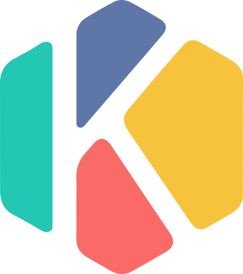

<p align="center">

<p>

<p align="center">


<a href="https://codecov.io/gh/wozien/kun-ui" > 
  
 </a>
<a href="https://github.com/wozien/kun-ui/
stargazers"></a>
<a href="https://github.com/wozien/kun-ui/blob/main/LICENSE"></a>
</p>

<h1> 🐔 Kun-UI </h1>

基于 vite 全家桶开发的 vue3 组件库 


## 特性
- [x] 🏆 使用 Vue3.0 最新特性开发
- [x] 🚀 全面基于 Vite，速度够快
- [x] ✂️ 支持完整引入和按需引入
- [x] 💪 严格的 TypeScript 类型
- [x] 👓 更多特性开发中

## 安装

使用 `pnpm` 安装

```bash
pnpm add @wozien/kun-ui --save-dev
```

使用 `yarn` 安装

```bash
yarn add @wozien/kun-ui --save-dev
```

## 快速开始

全局引入

```js
import { createApp } from "vue";
import KunUI from '@wozien/kun-ui';
import '@wozien/kun-ui/dist/style.css';

createApp(App).use(KunUI).mount('#app');
```

按需加载

```js
import { createApp } from "vue";
import { KunButton } from '@wozien/kun-ui';
import '@wozien/kun-ui/dist/button/style.css';

createApp(App).use(KunButton).mount('#app');
```

可以利用 `unplugin-vue-components` 进行自动按需引入， 更多可查看[插件文档](https://github.com/antfu/unplugin-vue-components)


## LICENSE
[MIT](LICENSE) @ James Zhang